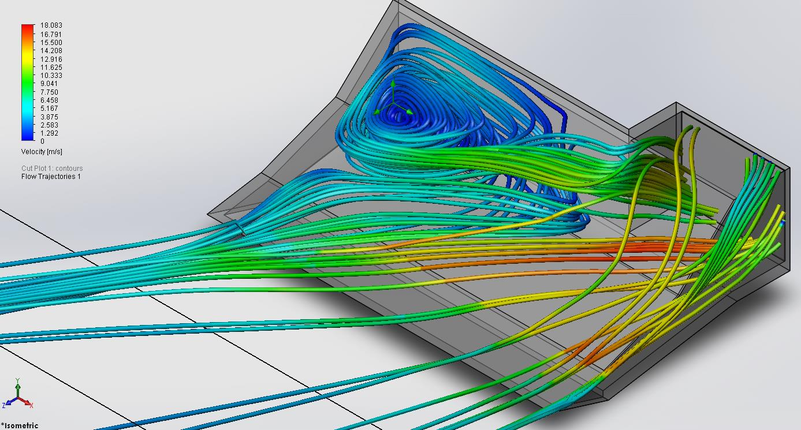
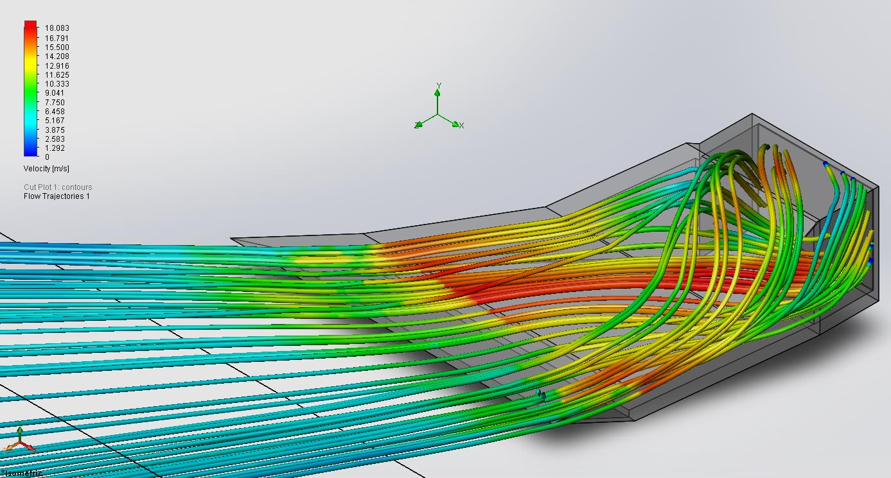

leapfrog-creatrhs-fan-duct
==========================

This repository containts the fan duct design and air flow simulation results from the CHILI laboratory at EPFL. The old design looks like this:

This design contains, as expected, a huge vortex next to the intake that should be avoided. The new design looks like this:

This is more efficient, has less mass and doesn't require support if it is 3D printed.
